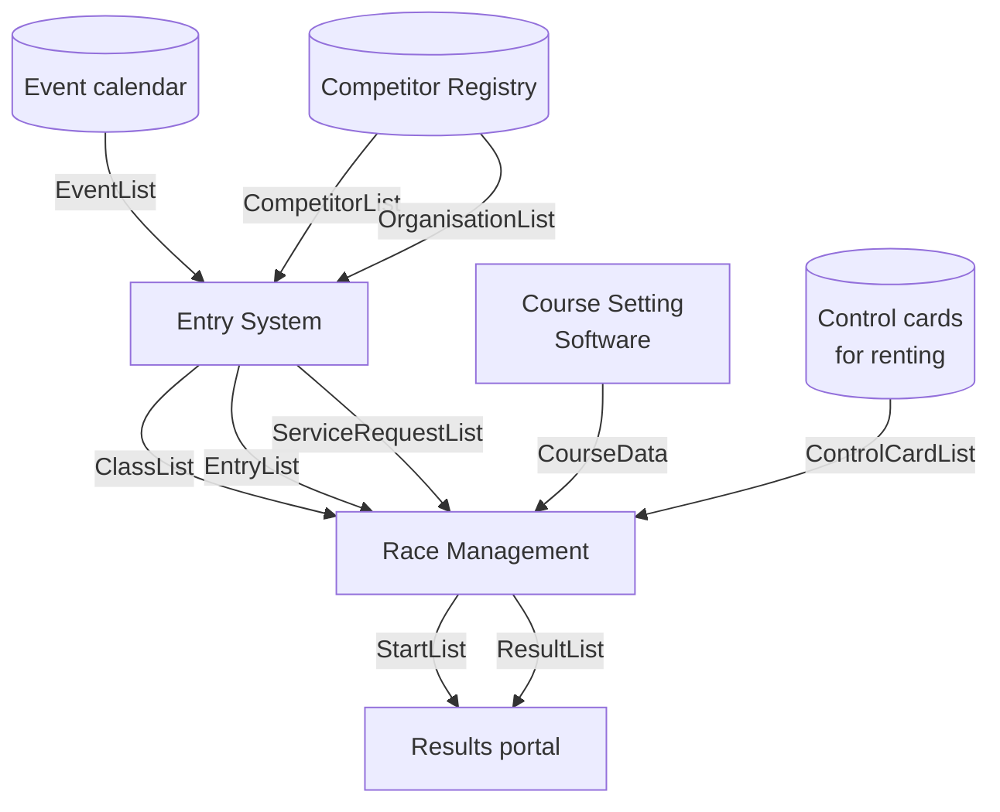
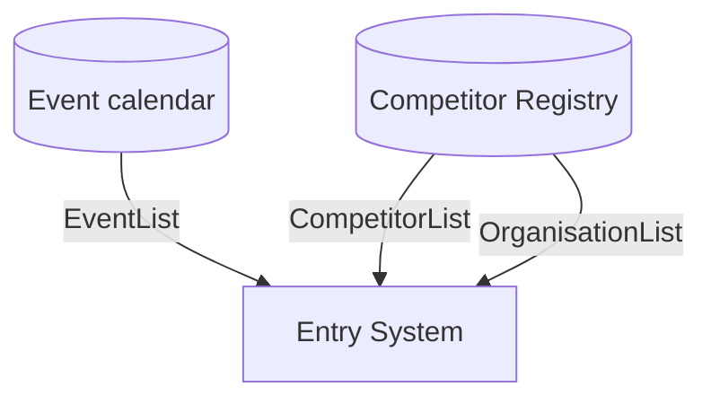
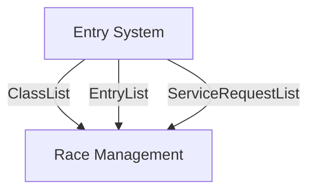
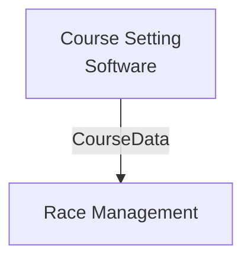
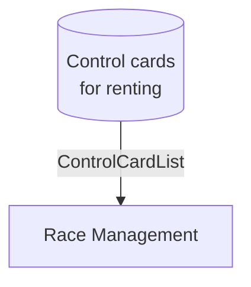
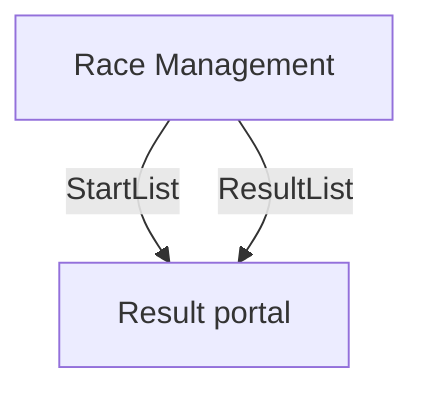

# Documentation

In an xml file there could be one or more of these list:

- CompetitorList
- OrganisationList
- EventList
- ClassList
- EntryList
- CourseData
- StartList
- ResultList
- ServiceRequestList
- ControlCardList

## Flow

Here is an example of a flow involving all the supported items:

### Entries

Let's imagine a federation that manages its own event calendar and has a list of affiliated clubs and their members.

An external system is asked to manage registrations for the federation's events. This system must have access to:

- list of events
- list of sports organizations
- list of members (for data autocompletion, e.g., to know the number of chips an athlete has)

IOF Datastandard schemas involved:

- `EventList`
- `CompetitorList`
- `OrganisationList`

Then the entries collected must be shared with the race management software. The data to be shared includes:

- list of the categories
- list of the entries
- list of the requested services (e.g. to manage the payments)

IOF Datastandard schemas involved:

- `ClassList`
- `EntryList`
- `ServiceRequestList`

### Courses

In order to check the sequence of the visited controls, the race management software needs information about the courses, which are drawn using another programme. For relays, the course setting software could assign sequences to bib numbers, so this information is included in the course data.

IOF Datastandard schemas involved:

- `CourseData`

### Control card renting

Many participants have their own chip, but in some cases the organization must provide one for rent or on loan. School competitions are one example. To do this, the race management software needs a list of available control cards.

IOF Datastandard schemas involved:

- `ControlCardList`

### Start list and results

In order to share the starting lists and final rankings with participants, the race management program must be able to export this information. An example of this could be the federation's results portal (which also calculates rankings).

IOF Datastandard schemas involved:

- `StartList`
- `ResultList`
